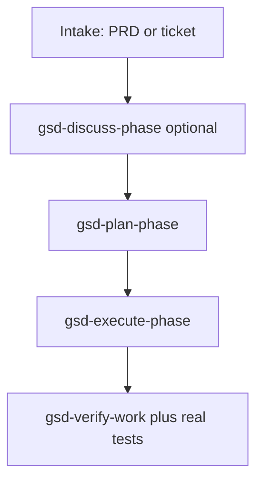

# GSD workflow playbooks — two real-world cases

How to use GSD when **you** run every `gsd-*` skill in Cursor. No Jira required for intake — a PRD or ticket markdown file is enough. Tracker stamps (recipe arm) are optional measurement on top.

Related: [GSD-TUTORIAL.md](GSD-TUTORIAL.md) (command labs) · [GSD-COMMANDS.md](GSD-COMMANDS.md) · [EXPERIMENT-AGENDA.md](EXPERIMENT-AGENDA.md)

**Operator rule:** Agents document and review artifacts only; **you** invoke GSD workflows.

---

## Shared ideas (both cases)

| Principle | Why |
|-----------|-----|
| `.planning/` is memory | Survives chat clears; ROADMAP + STATE drive what’s next |
| **Discuss** = your decisions | `CONTEXT.md` — not code |
| **Plan** = tasks + verify | `PLAN.md` — executor reads this |
| **Execute** = code + commits | One task ≈ one commit |
| **External truth** | Your tests / CI / grader — not `gsd-verify-work` alone |
| **PRD without Jira** | PRD file is intake; link ticket ID in CONTEXT when you have one |



---

## Case 1 — New project, PRD only (no Jira)

**Situation:** Greenfield repo or empty folder. You have a PRD (doc, markdown, Confluence export). No epic in Jira yet.

### Approach A — Full GSD project (multi-phase)

**Use for:** Full product / multi-sprint work. Maps to [gsd-tutorial-sandbox](GSD-TUTORIAL-SANDBOX.md) Case 1.

| Step | You invoke | Input | Output |
|------|------------|-------|--------|
| 0 | Install GSD in Cursor workspace | — | Skills available |
| 1 | `gsd-new-project` | Paste PRD or `@docs/PRD.md`; yolo OK | `PROJECT.md`, `REQUIREMENTS.md`, `ROADMAP.md`, `STATE.md`, `config.json` |
| 2 | `gsd-map-codebase` | Only if repo already has code | Skip on empty greenfield |
| 3a | `gsd-discuss-phase N` | Gray areas for this phase | `phases/0N-*/CONTEXT.md` |
| 3b | `gsd-plan-phase N` | Or `gsd-plan-phase N --prd docs/PRD.md` to skip discuss | `RESEARCH.md`?, `*-PLAN.md` |
| 3c | `gsd-execute-phase N` | — | Code + `SUMMARY.md` |
| 3d | `gsd-verify-work N` | Conversational UAT | Fix plan if needed |
| 3e | Your tests / CI | — | **Real pass/fail** |
| 4 | `gsd-ship N` | When ready; needs `gh` | PR |
| 5 | `gsd-complete-milestone` | All phases done | Archive, tag |

**Skip discuss when:** PRD has clear acceptance criteria per slice → `gsd-plan-phase 1 --prd path/to/PRD.md`. Still discuss phases where PRD is vague (UX, edge cases).

**Useful flags:**

| Situation | Flag |
|-----------|------|
| PRD is the spec | `--prd <file>` on plan-phase |
| ADRs / design docs exist | `--ingest 'docs/adr/*.md'` |
| Fast first slice | `gsd-mvp-phase 1` then plan |
| No time for research | `--skip-research` on plan-phase |
| Small one-off inside project | `gsd-quick` |

**Recipe layer (benchmark experiment, optional):**

1. Keep PRD in repo: `docs/PRD.md` (SSOT until Jira exists).
2. Hand-log start time at `gsd-new-project` (later: tracker stamps).
3. After each phase: log reopens + run your test suite.

**Minimal chain:**

```text
gsd-new-project
gsd-plan-phase 1 --prd docs/PRD.md
gsd-execute-phase 1
gsd-verify-work 1
go test ./...
gsd-progress
```

### Approach B — Thin path (single deliverable)

**Use for:** One feature or spike, not a full program.

```text
gsd-quick --discuss --validate "implement X from docs/PRD.md"
gsd-spike "is approach Y feasible?"
gsd-fast "tiny fix"
```

Artifacts under `.planning/quick/`. **Pick A for full project; B for one slice.**

---

## Case 2 — Existing project, new feature or bug

**Situation:** Code exists. Docs may be thin. Work arrives as feature PRD, ticket text, or bug report.

### Size → GSD path

| Size | GSD path |
|------|----------|
| Bug / tiny fix (1–3 files) | `gsd-fast` or `gsd-quick` |
| Small feature (one slice) | New `gsd-phase` or `gsd-quick --full` |
| Large feature / epic | discuss → plan → execute |
| Urgent hotfix | `gsd-phase --insert N "Hotfix"` → plan → execute |

### Case 2A — `.planning/` already exists

**Feature:**

```text
gsd-progress
gsd-phase "Add notifications"
gsd-discuss-phase N
gsd-plan-phase N --prd docs/feature-xyz.md
gsd-execute-phase N
gsd-verify-work N
go test ./...
gsd-code-review N
gsd-ship N
```

**Bug:**

```text
gsd-debug "symptom from ticket"
gsd-quick "fix: ..." --validate
```

Or multi-package fix:

```text
gsd-phase --insert 2 "Fix auth regression"
gsd-plan-phase 2.1
gsd-execute-phase 2.1
```

Record ticket ID in `CONTEXT.md` even without Jira (`Source: pasted from email`).

### Case 2B — No `.planning/` (brownfield)

**One-time setup:**

| Step | You invoke | Why |
|------|------------|-----|
| 1 | `gsd-map-codebase` or `--fast` | `.planning/codebase/` |
| 2a | `gsd-new-project` — “maintain X, add feature Y” | Full ROADMAP |
| 2b | `gsd-ingest-docs docs/` | Bootstrap from existing docs |
| 3 | `gsd-import` | External plan with conflict check |

Then same as **2A**.

**Feature, weak docs:**

```text
gsd-map-codebase --fast
gsd-new-project
gsd-discuss-phase 1
gsd-plan-phase 1 --research
gsd-execute-phase 1
```

**Bug, weak docs:**

```text
gsd-map-codebase --fast
gsd-debug "error / repro steps"
gsd-quick ...
```

### Case 2C — Ticket text only (no formal PRD)

1. Save as `docs/intake/FEATURE-123.md`.
2. `gsd-plan-phase N --prd docs/intake/FEATURE-123.md`
3. `gsd-discuss-phase N` only for ticket gaps.

Maps to benchmark brownfield: `gsd-map-codebase` + work under `runs/.../workspace/`.

---

## Side-by-side

| | Case 1: New + PRD | Case 2: Existing + feature/bug |
|--|-------------------|--------------------------------|
| First command | `gsd-new-project` (+ PRD) | `gsd-map-codebase` if no planning |
| Intake | `docs/PRD.md` | `docs/intake/*.md` or `--prd` |
| Skip discuss? | Often yes (`--prd`) | Often no |
| Plan | `gsd-plan-phase N` | Same; may `--insert` |
| Execute | `gsd-execute-phase N` | Same; bugs → `gsd-quick` / `gsd-debug` |
| Truth | Your tests | Same + regression |
| Tracker | File for now | ID in CONTEXT.md |

---

## Default rule

```text
New repo + PRD     → new-project → plan-phase --prd → execute → verify → your tests
Existing repo      → map-codebase (once) → progress → phase / quick / debug by size
No Jira            → markdown in docs/ is enough; recipe adds stamps later
```

---

## Map to tutorial repos

| Repo | Playbook |
|------|----------|
| `~/Projects/gsd-tutorial-sandbox` | Case 1 — greenfield from BRIEF/PRD |
| `gsd-benchmark` brownfield tasks | Case 2 — `tasks/<id>/`, `runs/.../workspace/` |

After Case 1 Session 0 (`gsd-new-project` done), continue [GSD-TUTORIAL.md](GSD-TUTORIAL.md) Module 1+.
