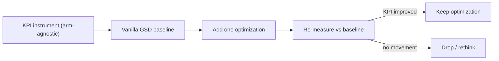

# SDLC blueprint: building a more optimal GSD

Goal: produce an **optimized version of GSD** and prove it is better with KPIs.
GSD already performs the SDLC work (discuss -> plan -> execute -> verify ->
review) through native skills, so we do **not** rebuild the lifecycle. The only
unconditional build is an **arm-agnostic KPI instrument** that measures vanilla
GSD and an optimized version on the same feature work. Every optimization is a
candidate that must move a KPI to earn its place.

Primary repo: **github.com/vs06101996/GSD_Plan**.

## Method: measure, then optimize



## KPIs

| KPI | Category | Derived from | Signals more optimal |
|-----|----------|--------------|----------------------|
| Stage cycle time | Velocity | adjacent milestone stamps | Faster at equal quality |
| End-to-end lead time | Velocity | first -> last stamp | Total throughput |
| Reopen count | Quality | `reopened` stamps | Fewer rework loops |
| First-pass yield | Quality | stages reached without a reopen | Fewer round-trips |
| Human-touch ratio | Effort | `actor=human` / all actor stamps | Less hand-holding |
| Grader pass rate | Correctness | `grade.json` | Quality floor held |
| Repeat-defect rate (P2) | Compounding | same defect across features | Does it learn |

## Stage map: what GSD covers vs what we instrument

GSD carries the middle of the lifecycle with native skills. We attach a stamp at
each stage so the same KPIs apply to every arm. Stamps never replace GSD work.

| Stage | GSD command (native) | Stamp (milestone) |
|-------|----------------------|-------------------|
| Intake | `gsd-import`, `gsd-new-project` | `started` |
| PRD finalize | `gsd-discuss-phase` | `prd-approved` |
| Decompose | `gsd-plan-phase`, `gsd-phase` | `engineering-ready` |
| Plan | `gsd-plan-phase`, `gsd-review` | (covered by next) |
| Dev | `gsd-execute-phase`, `gsd-quick` | `build-started` / `build-done` |
| Verify | `gsd-verify-work` | (feeds grader) |
| Review | `gsd-code-review`, `gsd-review` | `review-ready` / `approved` |
| Self-improve (P2) | (none native) | `kb-updated` |

`gsd-discuss-phase` and `gsd-code-review` already cover PRD-finalize and review,
so those stages need a stamp, not a new skill.

## The instrument

| Piece | File | Role |
|-------|------|------|
| Stamp schema | [bench/capture/stamp.schema.json](../bench/capture/stamp.schema.json) | Arm-agnostic, tracker-optional stamp shape |
| Emitter | [bench/runners/emit-stamp.sh](../bench/runners/emit-stamp.sh) | Append one immutable stamp (JSONL) |
| Aggregator | [bench/report/kpi.py](../bench/report/kpi.py) | Compute KPIs, print + write `KPI-REPORT.md` |

### Emit a stamp

```bash
# vanilla GSD, no tracker, agent advanced the stage
./bench/runners/emit-stamp.sh gsd run-01 started build agent

# recipe arm linked to a Jira issue, human approved
./bench/runners/emit-stamp.sh recipe run-01 approved review PROJ-123 human jira
```

Args: `<arm> <run_id> <status> <step> [issue_key] [actor] [tracker_system]`.
Omit `issue_key` for arms with no live tracker (it then records no tracker).

### Read the KPIs

```bash
python3 bench/report/kpi.py
```

Arms with no stamps show `no data` until a run is captured.

## Candidate optimizations (deferred — build only if KPIs justify)

Each is added one at a time and re-measured against the vanilla-GSD baseline:

- **`.sdlc/patterns/` convention** — org-global + repo-level knowledge, read-first
  during research and write-back during P2. Hypothesis: lifts first-pass yield and
  cuts repeat-defect rate.
- **Tracker bridge** — adapter (`pull_issue`, `create_subissue`, `link`,
  `transition`, `comment`); Jira impl via Atlassian MCP, GitHub stub. Hypothesis:
  cuts intake/handoff time and makes stamps SSOT-accurate.

## Out of scope (for now)

CI/CD deploy automation and runtime monitoring — future stages, not built yet.

## See also

- Experiment design: [docs/EXPERIMENT-AGENDA.md](EXPERIMENT-AGENDA.md)
- Roadmap: [.planning/ROADMAP.md](../.planning/ROADMAP.md)
- Recipe move per step: [docs/RECIPE-STEP-PRD-TO-STORIES.md](RECIPE-STEP-PRD-TO-STORIES.md)
